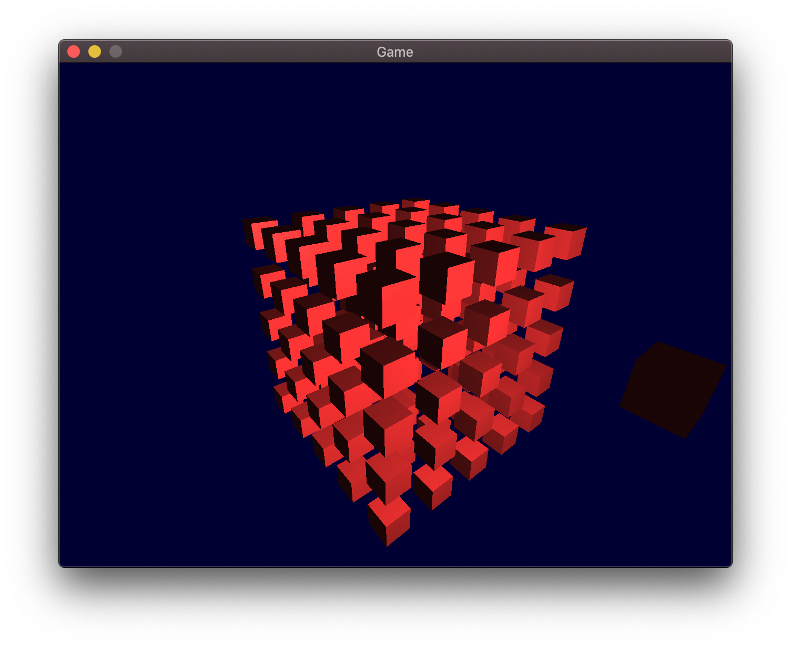

# Go Game

## Screenshot

Here is an example scene with a 5x5x5 grid and light source.

## Features

- Camera movement with WASD keys and mouse
- Dynamically shading models from moving light source
- Modular entity system